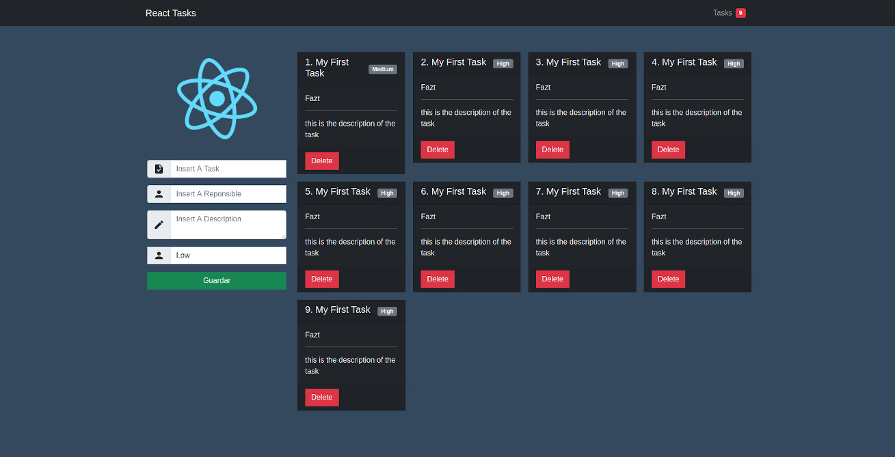
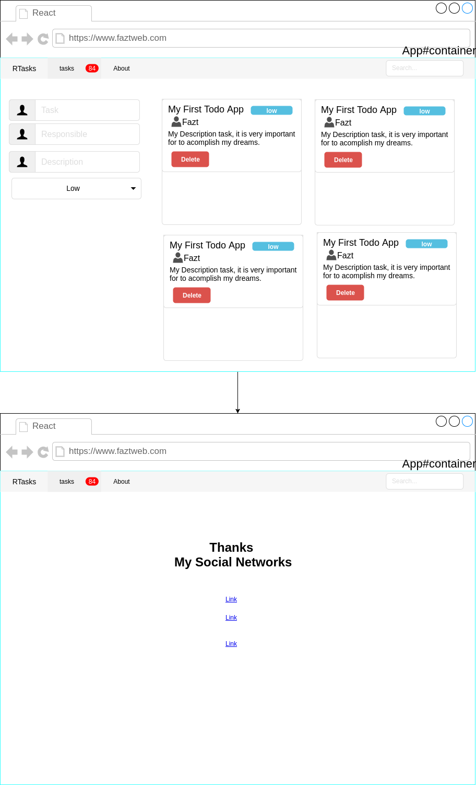

# React Tasks

A simple todo / task-management app built with **React 19** and **Vite**, used to practice basic React concepts (component composition, hooks, props, state).



## Stack

- React 19
- Vite 8
- Bootstrap 5 (via CDN)
- animate.css

## Getting started

```bash
git clone https://github.com/fazt/react-tasks
cd react-tasks
npm install
npm run dev
```

Open http://localhost:5173.

## Scripts

| Script            | Description                                |
| ----------------- | ------------------------------------------ |
| `npm run dev`     | Start the Vite dev server with HMR         |
| `npm run build`   | Build the production bundle into `dist/`   |
| `npm run preview` | Serve the built bundle locally for testing |

## Project structure

```
react-tasks/
├── index.html              # Vite entry HTML
├── public/
│   └── favicon.ico
├── src/
│   ├── main.jsx            # React entry point (createRoot)
│   ├── App.jsx
│   ├── App.css
│   ├── index.css
│   ├── tasks.json          # Initial seed data
│   └── components/
│       ├── Navbar.jsx
│       ├── TaskCard.jsx
│       └── TaskForm.jsx
└── vite.config.js
```

## Mockup



## Author

- Web: https://faztweb.com
- Blog: https://blog.faztweb.com
- Twitter / X: https://twitter.com/fazttech
